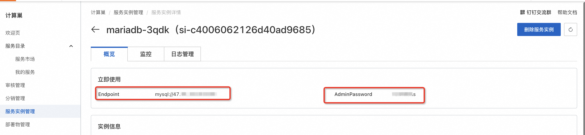
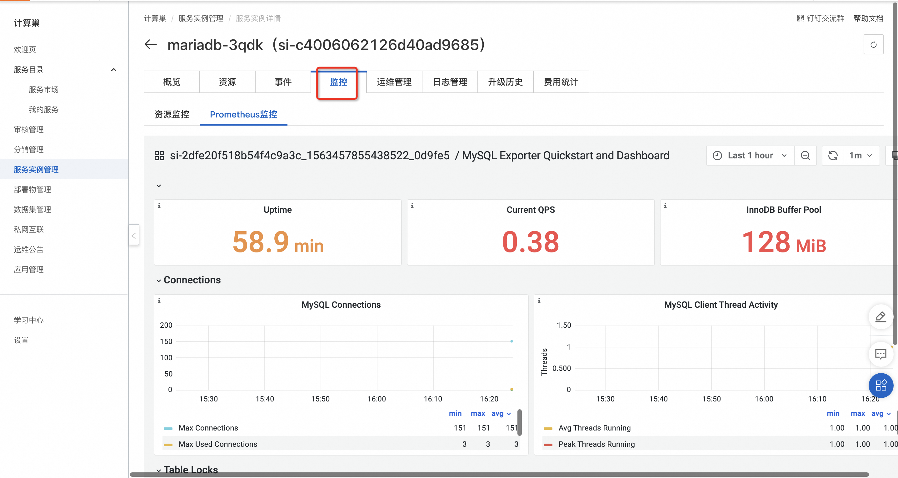

# 服务模版说明文档

## 服务说明

本文介绍容器服务部署mariadb实现托管版多租户的流程，本示例对应的[git地址](https://github.com/aliyun-computenest/mariadb-managed-ack-demo)。

根据该服务模板构建的服务默认包含三种套餐：

| 套餐名  | vCPU与内存      | 系统盘            |  
|--------|----------------|------------------|
| 低配版 | 1vCPU 1GiB | ESSD云盘 20GiB PL0 | 
| 基础版 | 2vCPU 2GiB  | ESSD云盘 40GiB PL0 | 
| 高配版 | 2vCPU 4GiB | ESSD云盘 80GiB PL0 |

本示例创建过程大约持续1分钟，当服务变成待提交后构建成功。

## 服务使用前提准备
本示例需要提前准备ack集群，且集群中需要安装mariadb-operator, 推荐使用[基础资源配置服务](https://computenest.console.aliyun.com/service/instance/create/cn-hangzhou?type=user&ServiceId=service-8c2fa279b8ab4ba38414)
，进行基础资源配置一键安装，可以选择已有ack集群也可以新建ack集群配置基础资源。如果是选择已有ack, 要确保ACK中已经安装阿里云Prometheus插件。

**注意**：一个集群只需配置一次基础资源，且给集群打开删除保护，避免误删除。

## 服务架构

本部署架构为ACK多租户部署，架构如下图所示：
1. 使用ingress根据域名路由到各个租户的mariadb
2. 每个租户一个k8s namespace，用namespace隔离
3. mariadb使用yaml部署


## 开启Prometheus监控配置
该服务支持配置Prometheus监控，服务实例部署成功后，服务商及其租户都能在控制台查看监控大盘, 开启Prometheus监控需要以下配置**(每个集群配置一次即可**)
### ACK集群中修改Prometheus的配置【需手动配置】
1. 到[容器服务控制台](https://cs.console.aliyun.com/)找到自己的集群，修改集群中prom-agent的启动参数，在“arms-prom”的namespace下找到名为“arms-prometheus
   -ack-arms-prometheus”的Deployment，点击"查看yaml"，
   
   找到启动参数，添加一行以下内容后，点击"更新"
```yaml
--nslabelSelector=tenant_userid,tenant_clusterid,tenant_token
```
如下图所示:

2.到[ARMS控制台](https://arms.console.aliyun.com/) 找到ACK集群对应的Promethues实例，也可以在容器控制台跳转到对应的Promethues实例，如下图所示：

修改Promethues实例的"服务发现"配置，开启自动同步集群内ServiceMonitor，如下图所示：

配置Promethues实例的采集规则，如下图所示，点击"编辑Prometheus.yaml"

添加以下内容，将下边这段内容中值替换后，添加到Prometheus.yaml中
```yaml
remote_write:
  - basic_auth:
      password: fake-AK-secret #服务商的AK信息
      username: fake-AK-id
    url: http://xxxx  #当前Prometheus实例的remoteWrite内网地址
```
其中username和password的值替换为您实际的AK信息，url的值替换为当前Prometheus实例的remoteWrite内网地址，可以在以下位置得到。

Prometheus.yaml示例如下：

### 模板中添加租户标签
该服务的架构为用namespace隔离各个租户的资源，为了区分各个租户的监控指标，需要给每个namespace打上租户标签，租户标签内容如下：
```yaml
tenant_userid: '{{ aliUid }}'
tenant_clusterid: '{{ tenantClusterId }}'
tenant_token: '{{ tenantToken }}'
tenant_cloudproductcode: '{{ tenantCloudProductCode }}'
```
该示例服务模板中已经正确配置该租户标签，可直接使用，无需重新配置。示例如下：
```yaml
 ClusterNameSpaceApplication:
    Type: ALIYUN::CS::ClusterApplication
    Properties:
      YamlContent:
        Fn::Sub:
          - |
            apiVersion: v1
            kind: Namespace
            metadata:
              name: '${Name}'
              labels:
                tenant_userid: '{{ aliUid }}'
                tenant_clusterid: '{{ tenantClusterId }}'
                tenant_token: '{{ tenantToken }}'
                tenant_cloudproductcode: '{{ tenantCloudProductCode }}'
          - Name: '{{ serviceInstanceId }}'
```
### 配置产品标识和对应的大盘链接
托管版多租服务使用计算巢提供的Prometheus能力，需要设置服务标识和监控大盘信息：
1. 服务标识：表示服务在监控系统中的唯一标识，该服务中使用"cn-mariadb"为服务标识，**cn-mariadb用于测试**，所有服务共享使用该产品标识。目前cn-mariadb
   已开通杭州和香港两个地域，支持在这个两个地域下测试。**若需要使用专用服务标识，详情可以通过工单或钉钉交流群咨询计算巢开发同学。**
2. 监控大盘设置包括监控大盘标题和Grafana大盘链接，监控大盘信息与服务标识是对应关系，在服务标识为cn-mariadb时，大盘标题默认为：MySQL Exporter Quickstart and
   Dashboard，大盘链接也是固定内容，无需修改。**如需要修改大盘信息，详情可以通过工单或钉钉交流群咨询计算巢开发同学**。
   该示例服务中已经配置好了监控大盘信息，无需修改，保持默认即可，配置示例如下：
   

## 服务构建计费说明

测试本服务构建无需任何费用，创建服务实例涉及的费用参考下文"服务实例计费说明"。

## RAM账号所需权限

本服务需要对ECS、VPC等资源进行访问和创建操作，若您使用RAM用户创建服务实例，需要在创建服务实例前，对使用的RAM用户的账号添加相应资源的权限。添加RAM权限的详细操作，请参见[为RAM用户授权](https://help.aliyun.com/document_detail/121945.html)。所需权限如下表所示。

| 权限策略名称                          | 备注                     |
|---------------------------------|------------------------|
| AliyunCSFullAccess             | 管理容器服务服务（CS）的权限       |
| AliyunROSFullAccess             | 管理资源编排服务（ROS）的权限       |
| AliyunComputeNestUserFullAccess | 管理计算巢服务（ComputeNest）的用户侧权限 |
| AliyunComputeNestSupplierFullAccess | 管理计算巢服务（ComputeNest）的服务商侧权限 |
| AliyunARMSFullAccess | 管理业务实时监控服务（ARMS）的权限 |


## 服务实例计费说明

测试本服务在计算巢上的费用主要涉及：

- 导入的ACK集群的费用
- 在ACK集群新建的磁盘、网络等费用


## 服务实例部署流程


### 部署参数说明

| 参数组         | 参数项  | 说明                                            |
|-------------|------|-----------------------------------------------|
| 服务实例        | 服务实例名称 | 长度不超过64个字符，必须以英文字母开头，可包含数字、英文字母、短划线（-）和下划线（_） |
|             | 地域   | 服务实例部署的地域                                     |
|             | 数据库root账号密码     | 各个租户的数据库管理密码                                  |

### 部署步骤

0. 部署链接
   
1. 单击部署链接，进入服务实例部署界面，根据界面提示，填写参数完成部署
   
2. 参数填写完成后可以看到对应询价明细，确认参数后点击**下一步：确认订单**
3. 确认订单完成后同意服务协议并点击**立即创建**
   进入待部署阶段。
   
4. 在用户侧进入待部署状态后需要服务商同意用户的部署
   
   
5. 等待部署完成后就可以开始使用服务，通过Endpoint即可访问mariadb
   
6. 部署成功后，用户侧和服务商都可以在控制台查看监控大盘
   用户侧：
   
   服务商侧：
   


## 售卖配置
当前服务因为没有配置售卖链路，所以用户侧部署时候需要服务商的二次确认，当服务上架到阿里云云市场后，就可以不经过服务商的二次确认就可以完成部署。

1. 计算巢服务审核上线
   上到云市场的商品需要在计算巢这里完成上架过程，走通预发布和发布流程，经过审核后上线。
   
2. 点击到云市场创建商品，选择类目SaaS服务计算巢托管版
   
   
3. 按要求添商品信息
4. 在销售信息时候选择预付费模式，并配置三个套餐，给三个套餐配置相应的价格
   
   
5. 完成商品上线和审核
   
6. 到计算巢完成套餐和云市场商品的绑定 (如果名字一样会自动匹配上，可以忽略这个步骤)
   
7. 完成部署
   
   
   

8. 至此完成了一个托管版上到云市场并使用的全过程

# 更多功能

## 计量计费

[自定义服务架构图](https://help.aliyun.com/zh/compute-nest/customize-a-service-architecture?spm=a2c4g.11186623.0.0.56e736bfyUdlFm])

[服务文档上线流程](https://help.aliyun.com/zh/compute-nest/use-cases/publish-documents-to-compute-nest?spm=a2c4g.313309.0.i0])

[将服务上架云市场并上到云市场售卖](https://help.aliyun.com/zh/compute-nest/publish-a-service-to-alibaba-cloud-marketplace?spm=a2c4g.11186623.0.i7])

## 服务配置

[创建代运维服务完成实例运维](https://help.aliyun.com/zh/compute-nest/create-a-hosted-operations-and-maintenance-service?spm=a2c4g.11186623.0.i24#task-2167552])

[创建包含变配功能的服务](https://help.aliyun.com/zh/compute-nest/use-cases/create-a-service-that-supports-specification-changes-and-change-the-specifications-of-a-service-instance?spm=a2c4g.11186623.0.i3])

[创建包含服务升级功能的服务](https://help.aliyun.com/zh/compute-nest/upgrade-a-service-instance?spm=a2c4g.11186623.0.i17#task-2236803)