# 服务模版说明文档

## 服务说明

本文介绍容器服务部署mariadb实现托管版多租户的流程，本示例对应的[git地址](https://github.com/aliyun-computenest/mariadb-managed-ack-demo)。

根据该服务模板构建的服务默认包含三种套餐：

| 套餐名  | vCPU与内存      | 系统盘            |  
|--------|----------------|------------------|
| 低配版 | 1vCPU 1GiB | ESSD云盘 20GiB PL0 | 
| 基础版 | 2vCPU 2GiB  | ESSD云盘 40GiB PL0 | 
| 高配版 | 2vCPU 4GiB | ESSD云盘 80GiB PL0 |

本示例需要提前准备ack集群，需要到[容器服务控制台](https://cs.console.aliyun.com/) 提前创建。
本示例创建过程大约持续1分钟，当服务变成待提交后构建成功。

## 服务架构

本部署架构为ACK多租户部署，架构如下图所示：
1. 使用ingress根据域名路由到各个租户的mariadb
2. 每个租户一个k8s namespace，用namespace隔离
3. mariadb使用yaml部署

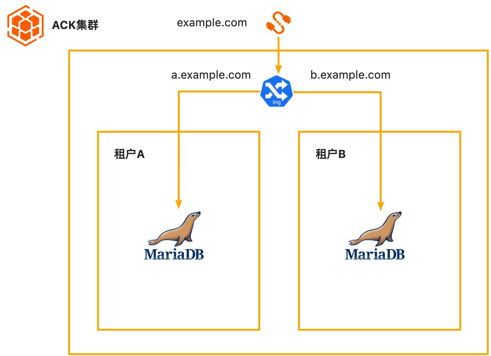

## 服务构建计费说明

测试本服务构建无需任何费用，创建服务实例涉及的费用参考下文"服务实例计费说明"。

## RAM账号所需权限

本服务需要对ECS、VPC等资源进行访问和创建操作，若您使用RAM用户创建服务实例，需要在创建服务实例前，对使用的RAM用户的账号添加相应资源的权限。添加RAM权限的详细操作，请参见[为RAM用户授权](https://help.aliyun.com/document_detail/121945.html)。所需权限如下表所示。

| 权限策略名称                          | 备注                     |
|---------------------------------|------------------------|
| AliyunCSFullAccess             | 管理容器服务服务（CS）的权限       |
| AliyunROSFullAccess             | 管理资源编排服务（ROS）的权限       |
| AliyunComputeNestUserFullAccess | 管理计算巢服务（ComputeNest）的用户侧权限 |
| AliyunComputeNestSupplierFullAccess | 管理计算巢服务（ComputeNest）的服务商侧权限 |


## 服务实例计费说明

测试本服务在计算巢上的费用主要涉及：

- 导入的ACK集群的费用
- 在ACK集群新建的磁盘、网络等费用


## 服务实例部署流程


### 部署参数说明

| 参数组         | 参数项    | 说明                                                                     |
|-------------|--------|------------------------------------------------------------------------|
| 服务实例        | 服务实例名称 | 长度不超过64个字符，必须以英文字母开头，可包含数字、英文字母、短划线（-）和下划线（_） |
|             | 地域     | 服务实例部署的地域                                                              |

### 部署步骤

0. 部署链接
 
1. 单击部署链接，进入服务实例部署界面，根据界面提示，填写参数完成部署
 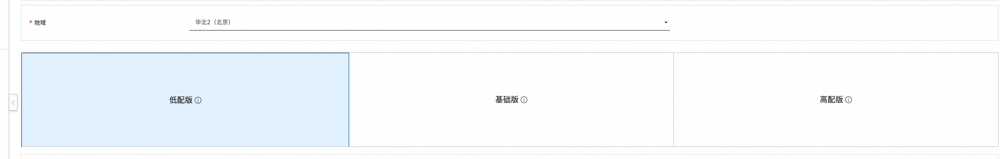
2. 参数填写完成后可以看到对应询价明细，确认参数后点击**下一步：确认订单**
3. 确认订单完成后同意服务协议并点击**立即创建**
   进入待部署阶段。
    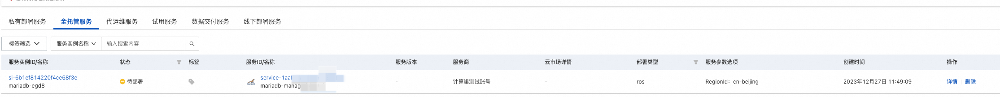
4. 在用户侧进入待部署状态后需要服务商同意用户的部署
    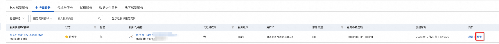
    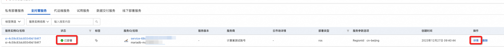
5. 等待部署完成后就可以开始使用服务，通过Endpoint即可调用mariadb
    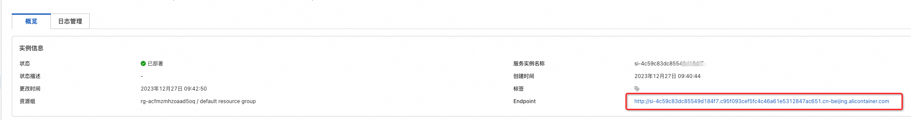

## 售卖配置
当前服务因为没有配置售卖链路，所以用户侧部署时候需要服务商的二次确认，当服务上架到阿里云云市场后，就可以不经过服务商的二次确认就可以完成部署。

1. 计算巢服务审核上线
    上到云市场的商品需要在计算巢这里完成上架过程，走通预发布和发布流程，经过审核后上线。
    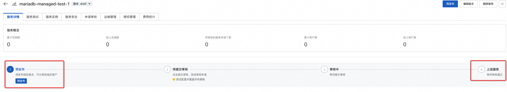
2. 点击到云市场创建商品，选择类目SaaS服务计算巢托管版
    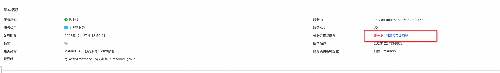
    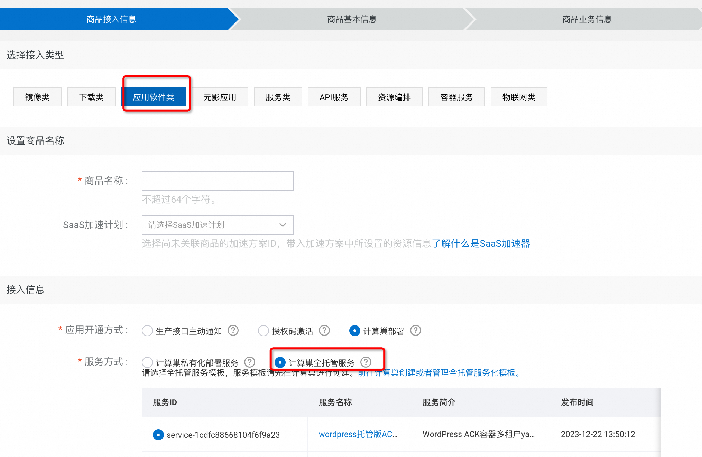
3. 按要求添商品信息
4. 在销售信息时候选择预付费模式，并配置三个套餐，给三个套餐配置相应的价格
    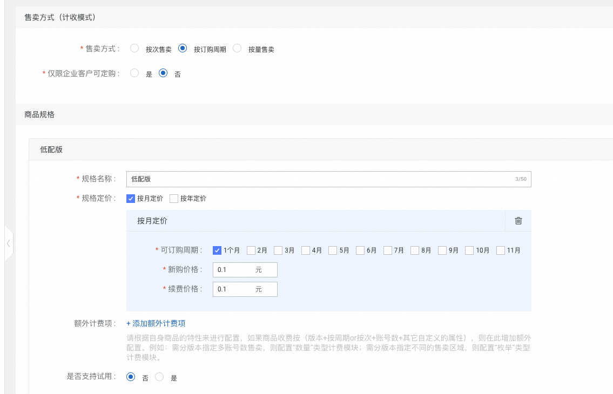
    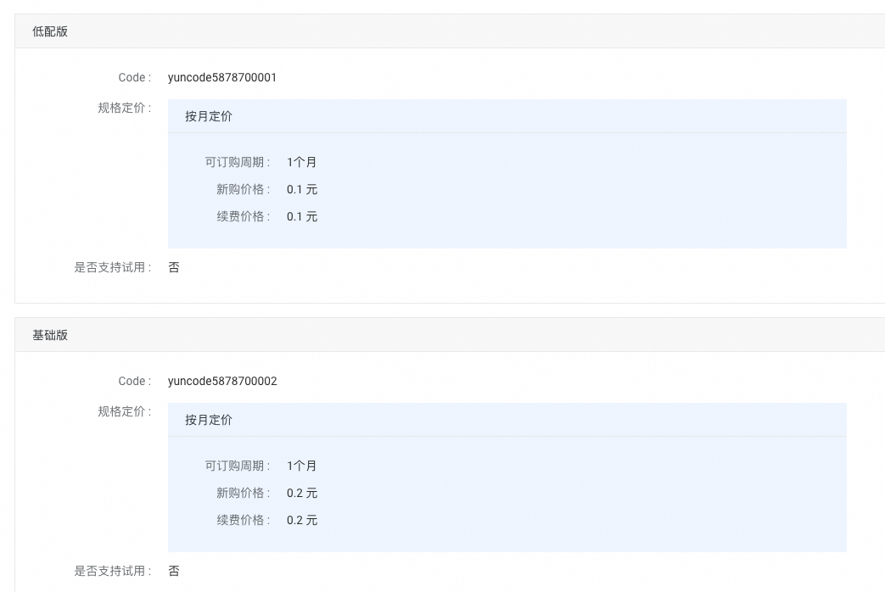
5. 完成商品上线和审核
    
6. 到计算巢完成套餐和云市场商品的绑定 (如果名字一样会自动匹配上，可以忽略这个步骤)
    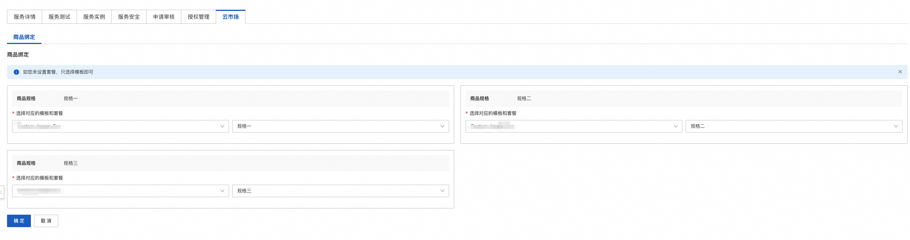
7. 完成部署
    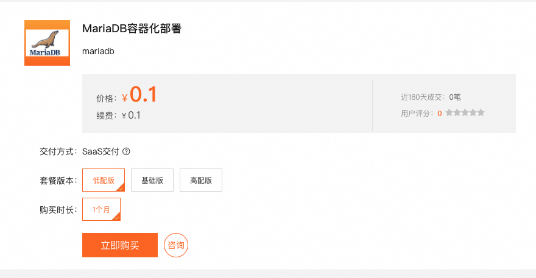
    
    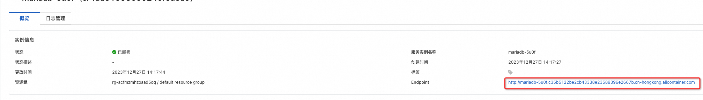
    
8. 至此完成了一个托管版上到云市场并使用的全过程

## 服务详细说明

通过ALIYUN::CS::ClusterApplication部署yaml到k8s，并给每个租户对应到不同namespace上，部署中公用ack的节点池。

详细对应到template.yaml的代码片段如下文所示，代码片段主要进行三项工作:
1. 创建部署mariadb必要的配置
2. 部署 mariadb
3. 部署ingress根据域名将endpoint对应到新创建的mariadb的service上

```yaml
  ClusterApplication:
    Type: ALIYUN::CS::ClusterApplication
    Properties:
      YamlContent:
        Fn::Sub:
          - |
            apiVersion: v1
            kind: Secret
            metadata:
              name: ${Name}-secret
            data:
              password: bWFyaWFkYg==
            ---
            apiVersion: v1
            kind: ConfigMap
            metadata:
              name: ${Name}-mariadb-config
            data:
              mariadb.cnf: |
                [mariadb]
                bind-address=*
                default_storage_engine=InnoDB
                binlog_format=row
                innodb_autoinc_lock_mode=2
                max_allowed_packet=256M
            ---
            apiVersion: apps/v1
            kind: StatefulSet
            metadata:
              name: ${Name}-mariadb
            spec:
              serviceName: ${Name}-mariadb
              replicas: 1
              selector:
                matchLabels:
                  app: ${Name}-mariadb
              volumeClaimTemplates:
                - metadata:
                    name: data
                  spec:
                    accessModes:
                      - ReadWriteOnce
                    storageClassName: alicloud-disk-essd
                    resources:
                      requests:
                        storage: ${Storage}
              template:
                metadata:
                  labels:
                    app: ${Name}-mariadb
                spec:
                  volumes:
                    - name: ${Name}-mariadb-config
                      configMap:
                        name: ${Name}-mariadb-config
                  containers:
                    - name: mariadb
                      image: mariadb:11.0.3
                      resources:
                        limits:
                          cpu: ${Vcpu}
                          memory: ${Memory}
                        requests:
                          cpu: ${Vcpu}
                          memory: ${Memory}
                      env:
                        - name: MYSQL_ROOT_PASSWORD
                          valueFrom:
                            secretKeyRef:
                              name: ${Name}-secret
                              key: password
                      ports:
                        - containerPort: 3306
                          name: mariadb
                      volumeMounts:
                        - name: data
                          mountPath: /var/lib/mysql
                        - name: ${Name}-mariadb-config
                          mountPath: /etc/mysql/mariadb.conf.d/conf.d
            ---
            apiVersion: v1
            kind: Service
            metadata:
              name: ${Name}-mariadb
            spec:
              selector:
                app: ${Name}-mariadb
              ports:
                - port: 3306
                  targetPort: 3306
                  protocol: TCP
            ---
            apiVersion: networking.k8s.io/v1
            kind: Ingress
            metadata:
              name: ${Name}-mariadb
            spec:
              rules:
                - host: ${Name}.${ClusterId}.${RegionId}.alicontainer.com
                  http:
                    paths:
                      - path: /
                        backend:
                          service:
                            name: ${Name}-mariadb
                            port:
                              number: 3306
                        pathType: ImplementationSpecific
          - Name:
              Fn::Replace:
                - _ : '-'
                - Ref: ALIYUN::StackName
            RegionId:
              Ref: ALIYUN::Region
            ClusterId:
              Ref: ClusterId
            Storage:
              Ref: Storage
            Memory:
              Ref: Memory
            Vcpu:
              Ref: Vcpu
      ClusterId:
        Ref: ClusterId
      DefaultNamespace:
        Fn::Replace:
          - _: '-'
          - Ref: ALIYUN::StackName
```
# 更多功能

## 计量计费

[自定义服务架构图](https://help.aliyun.com/zh/compute-nest/customize-a-service-architecture?spm=a2c4g.11186623.0.0.56e736bfyUdlFm])

[服务文档上线流程](https://help.aliyun.com/zh/compute-nest/use-cases/publish-documents-to-compute-nest?spm=a2c4g.313309.0.i0])

[将服务上架云市场并上到云市场售卖](https://help.aliyun.com/zh/compute-nest/publish-a-service-to-alibaba-cloud-marketplace?spm=a2c4g.11186623.0.i7])

## 服务配置

[创建代运维服务完成实例运维](https://help.aliyun.com/zh/compute-nest/create-a-hosted-operations-and-maintenance-service?spm=a2c4g.11186623.0.i24#task-2167552])

[创建包含变配功能的服务](https://help.aliyun.com/zh/compute-nest/use-cases/create-a-service-that-supports-specification-changes-and-change-the-specifications-of-a-service-instance?spm=a2c4g.11186623.0.i3])

[创建包含服务升级功能的服务](https://help.aliyun.com/zh/compute-nest/upgrade-a-service-instance?spm=a2c4g.11186623.0.i17#task-2236803)